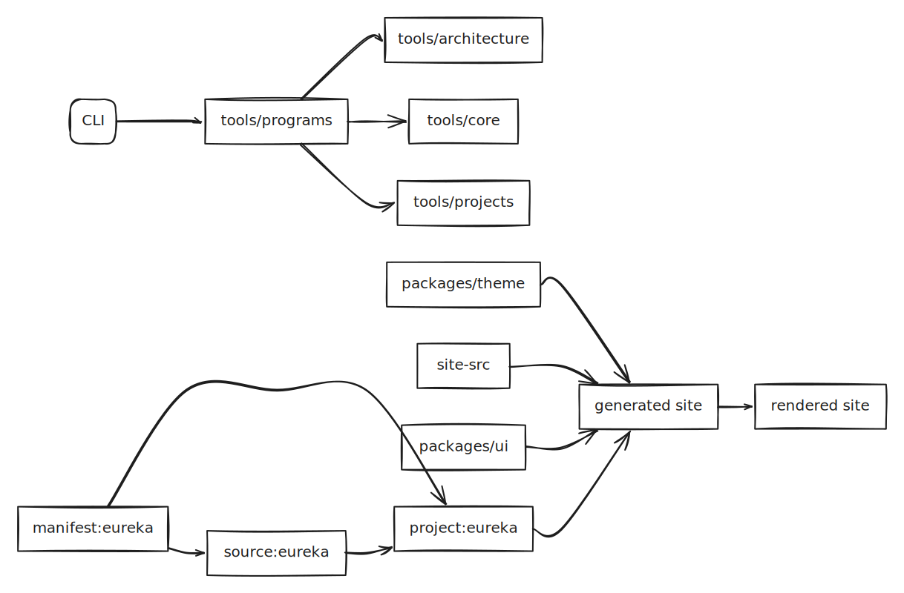

# leowajda.github.io

Personal site plus source-driven project generators. The main dynamic project is `eureka`, which reads external source data and generates rendered site pages and data from it.

## Commands

- Install deps: `pnpm install && bundle install`
- Sync sources: `pnpm sync:sources`
- Generate site: `pnpm generate`
- Preview rendered site: `pnpm preview`
- Typecheck: `pnpm typecheck`
- Tool tests: `pnpm test:tools`
- Refresh docs + diagrams: `pnpm docs:refresh`

## Architecture

Generated from the current repo graph: 13 nodes, 12 edges.

## Module Map

### Source Repos
- `source:eureka`: sources/eureka

### Project Manifests
- `manifest:eureka`: projects/eureka.yml

### Tools
- `tools/architecture`: 6 tracked files
- `tools/core`: 8 tracked files
- `CLI`: 1 tracked file
- `tools/programs`: 4 tracked files
- `tools/projects`: 5 tracked files
- `project:eureka`: 4 tracked files

### Packages
- `packages/ui`: 4 tracked files
- `packages/theme`: 13 tracked files

### Site
- `site-src`: 14 tracked files
- `generated site`: site/
- `rendered site`: _site/

## AI Workflow

- Use `pnpm preview` to boot the real rendered site on `http://127.0.0.1:4173`.
- Use the repo Playwright config for browser inspection, screenshots, and DOM checks.
- Prefer debugging rendered pages over raw templates.
- See `AGENTS.md` for the concise runbook.
